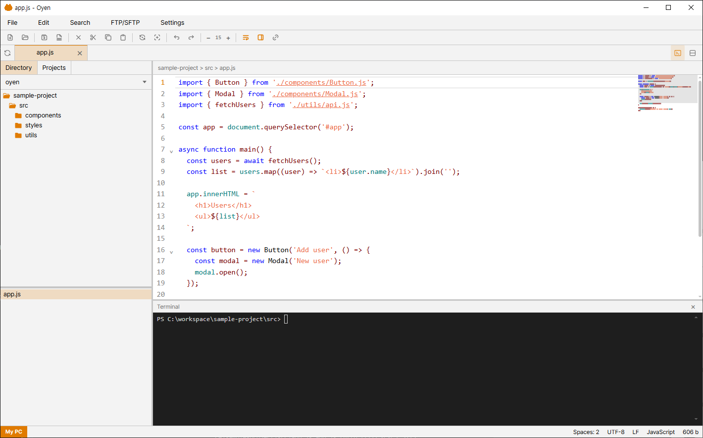
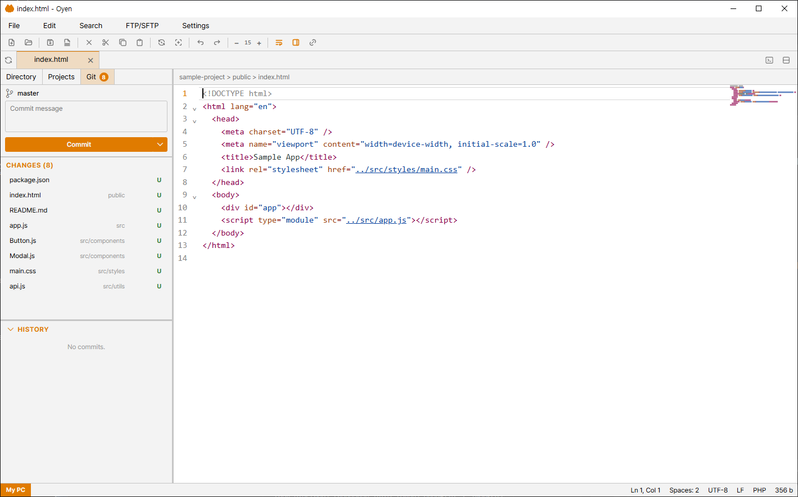
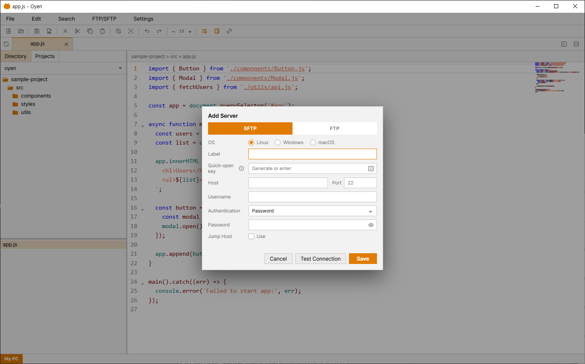
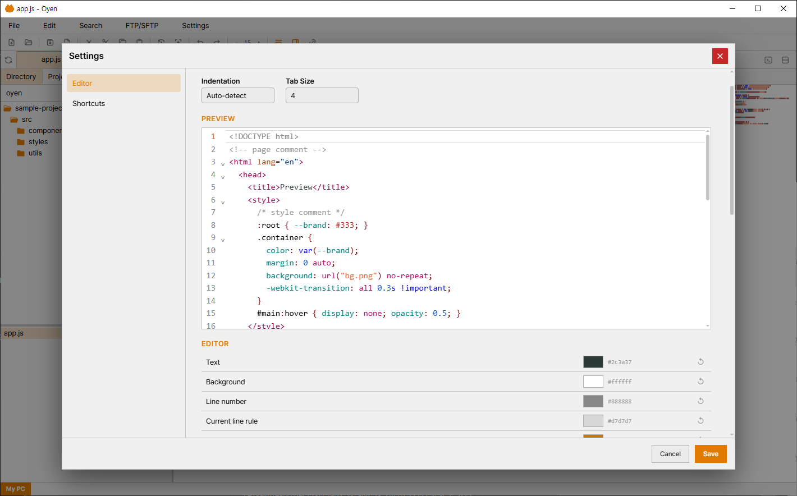

<div align="center">

# OYEN

A lightweight desktop code editor with an integrated terminal, file tools, and remote SFTP/FTP support.

<!-- Replace with a screenshot of the main window (editor + file tree + terminal) -->


</div>

## Overview

OYEN is a compact desktop editor in the spirit of classic editors like EditPlus, with a clean light theme and a modern toolchain. It pairs a fast code editor with a real terminal, a file manager, and first-class remote editing over SFTP/FTP — all in one window.

Built with Electron, Vite, and CodeMirror 6. Runs on Windows, macOS, and Linux.

## Features

- **Code editor** — CodeMirror 6 with syntax highlighting for PHP, Python, JavaScript, HTML, CSS, JSON, Markdown, SQL, XML, YAML and more. Multiple cursors, minimap, and search & replace.
- **Integrated terminal** — a real shell (xterm.js + node-pty) docked at the bottom.
- **File tree** — browse, open, create, rename, and manage files and folders.
- **Remote editing (SFTP / FTP / FTPS)** — connect to servers with saved profiles, jump host support, and host key verification. Edit remote files as if they were local.
- **Git integration** — status markers, diff gutter, commit / push / pull / sync, and a commit history view. Works on local repositories and remote ones over SSH.
- **Previews** — images, PDF, video, audio, and Markdown rendered right in the editor.
- **Tabs & split view**, a status bar, and a compact EditPlus-style layout.
- **Customizable** — tune editor and syntax colors, and rebind keyboard shortcuts.
- **Internationalization** — English and Korean.

## Screenshots

<!-- Add your screenshots under docs/screenshots/ and update the paths below -->

| Git panel | Remote (SFTP) | Settings |
| --- | --- | --- |
|  |  |  |

## Download

Pre-built installers are published on the [Releases](../../releases) page:

- **Windows** — installer (`.exe`) and a portable build
- **Linux** — `.AppImage`

macOS builds aren't published yet — build from source for now (see below).

## Build from source

OYEN uses native modules (node-pty for the terminal, ssh2 for remote access). The required native-module patches are applied automatically on install via a postinstall step, so the build works the same on every platform:

```bash
npm install      # installs dependencies + applies native-module patches
npm run rebuild  # rebuild native modules for Electron
npm run dist     # build → release/
```

On Windows you can also just run `setup.bat`, which runs the install and rebuild for you.

Native builds need your platform's standard build tools — Visual Studio Build Tools (Windows), `build-essential` (Linux), or Xcode Command Line Tools (macOS).

## Tech stack

Electron · Vite · CodeMirror 6 · xterm.js · ssh2 · basic-ftp

## License

OYEN is released under the [MIT License](LICENSE).

Bundled fonts (Pretendard, Cascadia Mono) are licensed under the SIL Open Font License 1.1 — see the license files next to them in `src/renderer/styles/fonts/`.

## Support

If you find OYEN useful, you can support its development through [GitHub Sponsors](https://github.com/sponsors/llack). Thank you!
